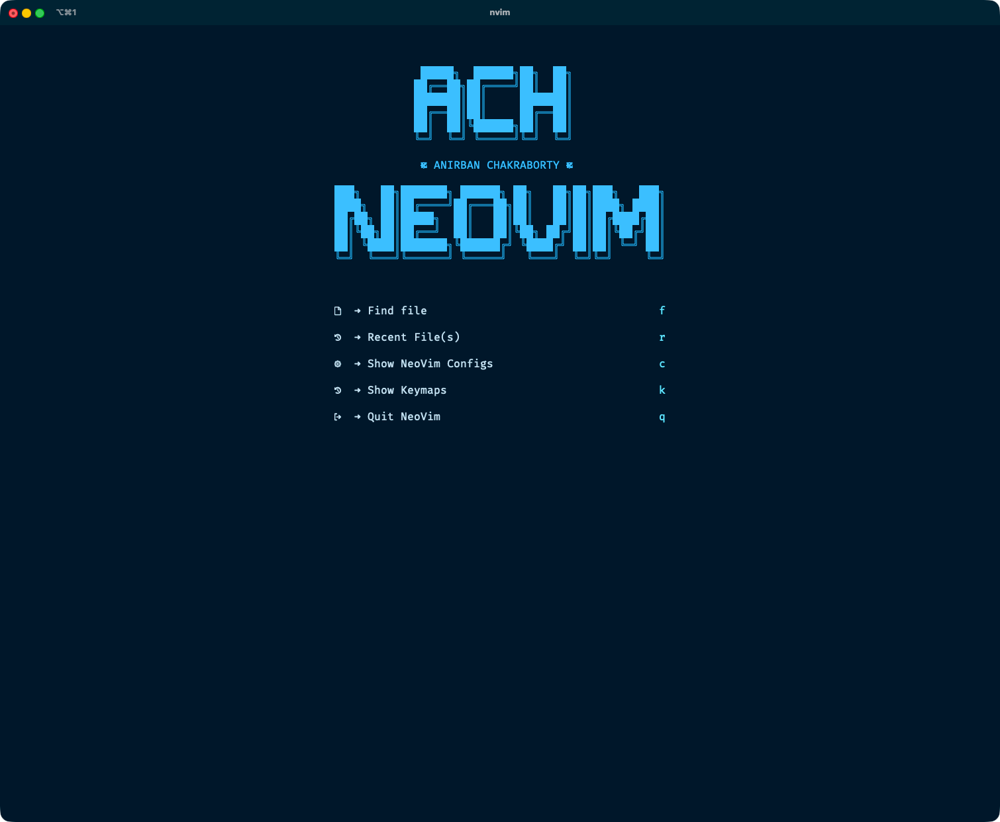

# ACH NEOVIM

A modern, fast, and icon-rich Neovim configuration built from scratch with [`Lazy`](https://github.com/folke/lazy.nvim) plugin manager.

<div style="text-align:center">



</div>

---

## Philosophy

This configuration is built to be:

- **Fast:** Uses modern, high-performance plugins like [`nvim-cmp`](https://github.com/hrsh7th/nvim-cmp), [`fzf-lua`](https://github.com/ibhagwan/fzf-lua), and the [`mini.nvim`](https://github.com/echasnovski/mini.nvim) suite.
- **Beautiful:** A custom [`tokyonight`](https://github.com/folke/tokyonight.nvim) theme, with option to turn on transparent background, and a central icon library (`lua/configs/all_the_icons.lua`) ensure a consistent, beautiful UI.
- **Modular:** A clean separation between core config (`lua/configs/`) and plugin specifications (`lua/plugins/`).
- **Batteries-Included:** Comes pre-configured with a full development environment for Lua, Python, Markdown, LaTeX, and Shell scripting. Other language supports can also be easily added.

---

## Core Features

- **Plugin Manager:** Fully managed by **[`lazy.nvim`](https://github.com/folke/lazy.nvim)**.
- **Completion:** High-speed completion provided by **[`nvim-cmp`](https://github.com/hrsh7th/nvim-cmp)**.
- **Fuzzy Finder:** **[`fzf-lua`](https://github.com/ibhagwan/fzf-lua)** is at the core of all file finding, buffer, and code navigation.
- **LSP:** Full language server support via **[`nvim-lspconfig`](https://github.com/neovim/nvim-lspconfig)**, with servers and tools automatically installed by **[`mason.nvim`](https://github.com/williamboman/mason.nvim)**.
- **Formatting & Linting:** Automatic formatting on save using **[`conform.nvim`](https://github.com/stevearc/conform.nvim)** and linting via built-in LSP diagnostics.
- **Git Integration:** Beautiful [`gitsigns.nvim`](https://github.com/lewis6991/gitsigns.nvim) in the gutter and a floating **[`lazygit`](https://github.com/jesseduffield/lazygit)** terminal via [`toggleterm.nvim`](https://github.com/akinsho/toggleterm.nvim).
- **Statusline:** A custom, icon-heavy **[`lualine.nvim`](https://github.com/nvim-lualine/lualine.nvim)** config.
- **UI Enhancements:**
    - **[`noice.nvim`](https://github.com/folke/noice.nvim)** replaces the default command line and messages.
    - **[`which-key.nvim`](https://github.com/folke/which-key.nvim)** provides an indispensable pop-up for keymaps.
    - **[`alpha-nvim`](https://github.com/goolord/alpha-nvim)** for the custom dashboard.
- **Markdown Suite:**
    - **[`peek.nvim`](https://github.com/toppair/peek.nvim)**: Live, real-time markdown preview.
    - **[`render-markdown.nvim`](https://github.com/MeanderingProgrammer/render-markdown.nvim)**: Renders LaTeX and other rich elements directly in the buffer.
    - Pandoc PDF export keymap.
- **Utilities:** A large set of lightweight plugins from **[`mini.nvim`](https://github.com/echasnovski/mini.nvim)**.
- **File Explorer:** Uses **[`oil.nvim`](https://github.com/stevearc/oil.nvim)** for a `vim-like` buffer-based file editing experience.

---

## ⌨Keymaps

Keymaps in this config follow a structured `<leader>`-based system.

See the complete auto-generated mapping list:

**[Keymaps.md →](./Keymaps.md)**

---

## Installation

### Pre-requisites (install before starting Neovim)

- **[`neovim`](https://formulae.brew.sh/formula/neovim)** — `brew install neovim`
- **[`tree-sitter-cli`](https://formulae.brew.sh/formula/tree-sitter-cli)** — `brew install tree-sitter-cli`
- **[`curl`](https://formulae.brew.sh/formula/curl)** — `brew install curl`
- **[`fzf`](https://formulae.brew.sh/formula/fzf)** — `brew install fzf`
- **[`ripgrep`](https://formulae.brew.sh/formula/ripgrep)** — `brew install ripgrep`
- **[`fd`](https://formulae.brew.sh/formula/fd)** — `brew install fd`
- **[`git`](https://formulae.brew.sh/formula/git)** — `brew install git`
- **[`deno`](https://formulae.brew.sh/formula/deno)** — `brew install deno`
- **[`pandoc`](https://formulae.brew.sh/formula/pandoc)** — `brew install pandoc`
- **[`mactex`](https://formulae.brew.sh/cask/mactex)** — `brew install --cask mactex`
- **[`python`](https://formulae.brew.sh/formula/python)** — `brew install python`
- **[`pipx`](https://formulae.brew.sh/formula/pipx)** — `brew install pipx`
- **[`pylatexenc`](https://pypi.org/project/pylatexenc/)** — `pip install pylatexenc`

---

### Steps

1. **Clone the configuration:**

   ```bash
   git clone https://github.com/anirbanchakraborty/ach-neovim.git ~/.config/nvim
   ```

2. **Start Neovim:**

   ```bash
   nvim
   ```

3. **Wait:** `lazy.nvim` will automatically install everything. Restart Neovim when finished.

---
